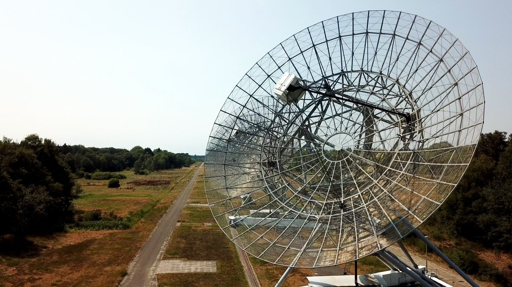

# Modelling Radioactive Decay Using Python 3
### Written by Inigo Val

### Why is programming important in Physics?

In this new era of technology, the computer is as important a part of a Physicist's tool box as a pencil and paper.

* The further you progress in Physics, the less 'neat' the solutions become. Often there is not one solution to a problem, but a _family_ of solutions from which we choose ones that fit based on some constraints. You may have experienced this already if you have studied differential equations in Maths. In real life situations, a computer is usually much better at finding a solution that fits if the constraints are complicated.

* Physics is fundamentally data driven. We require data from experiments to drive our theoretical models and confirm or reject their hypotheses. In the past, measurements have been taken by hand (such as looking at photographic film and estimating the intensity of a star). However, this is vastly inefficient compared with an automated system using computers. For example, a new field called Astrostatics has recently emerged which directly tackles handling very large amounts of data (millions of measurements) by using the power of programming techniques such as machine learning.

*The LOFAR radio telescope array uses machine learning to search for pulsars (collapsed neutron stars rotating at high speed)*

### What does this lab contain?

In this lab, we will be using the programming language Python 3 to create a model simulating the radioactive decay of a number of particles over time.

In order to complete this lab you should be comfortable with exponential decay and half lives. You must have come across vectors and matrices before (although no in depth knowledge is required). __No previous programming knowledge is required__. This excercise aims to be self contained so you should be able to jump right in without any prior reading. You are however encouraged to use google as you go through the excercises to help you understand/find syntax. 

We will mainly be using the [NumPy](http://www.numpy.org/) _package_ which provides a powerful framework for numerical computations in Python. We will also use the [MatPlotLib](https://matplotlib.org/) to visualise some of our results.

All excercises _without_ asterisks should be completed; tasks _with_ asterisks are extensions and are usually more exploratory. These can be omitted until you have finished all other tasks.

#### In order to use this notebook, you will have to [clone the repository](https://help.github.com/en/articles/cloning-a-repository) to your computer first. Make sure to do this in an empty folder.

Copyright (c) 2019 Inigo Val Slijepcevic
